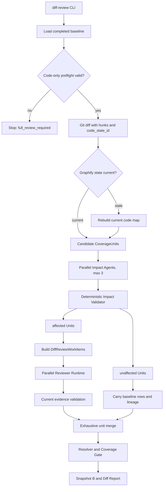

# Code-Only Incremental Compliance Review Redesign - Plan

## Goal Capsule

- **Objective:** 将当前按 `repository_id + surface` 粗粒度重审的 Diff Review，升级为以 CoverageUnit 为决策边界、以并行 Impact Agent 为语义判断层、以确定性 Validator 为安全边界的代码增量审查。
- **Authority hierarchy:** 非代码输入一致性和 Git 变更事实由程序决定；Impact Agent 只建议 `affected` 或 `unaffected`；Impact Validator 可以强制 `affected`；Reviewer 只审被判定为受影响的 CoverageUnit；Resolver 和 Coverage Gate 继续拥有最终状态权威。
- **Execution profile:** 仅代码仓库变化进入 Diff Review。Control、Obligation、政策来源、App Profile、API 文档或外部材料变化时拒绝增量模式并要求 Full Review。
- **Stop conditions:** 任一候选 CoverageUnit 缺少唯一 Impact decision、Graphify 使用了过期索引、受影响 Unit 没有 Reviewer 终态、未受影响 Unit 没有完整继承基线状态，或当前 run 无法覆盖全部 CoverageUnit 时，Diff Review 不得生成可用快照。
- **Tail ownership:** 实现必须完成领域模型迁移、运行链路、持久化产物、CLI、中文增量报告、自动化测试和一次真实仓库 Full-to-Diff 验收。

---

## Product Contract

### Summary

新版 Diff Review 先验证当前 run 与基线使用同一套法规、Control、画像和非代码材料，再对 Git 代码差异建立精确的文件与 hunk 清单。程序先按仓库和证据面得到候选 CoverageUnit；最多三个 Impact Agent 并行判断每个候选 Unit 是否真正受影响；确定性 Validator 校验完整性、引用和基线 Anchor 重叠，并把任何异常保守转换为 `affected`。只有受影响 Unit 会生成 Diff Reviewer WorkItem，未受影响 Unit 的原结论、证据状态和阻断信息原样继承。最终产出简洁的增量报告，并把当前 run 作为下一次 Diff Review 的直接基线。

### Problem Frame

当前 `DiffReviewPlanner` 只要发现某个仓库有代码变化，就会把该仓库所属 Surface 的全部 CoverageUnit 标记为受影响。一个样式文件变化也可能触发同 Surface 全量重审，无法体现 Graphify 的调用关系优势，也不能区分与法规要求无关的修改。

当前复用条件只接受 `PASS + complete + valid`。这会让未受影响但原本为 `fail`、`partial` 或 `indeterminate` 的 Unit 被重复审查。重复审查既浪费模型调用，也可能让相同代码在不同 run 中产生不稳定结论。另一方面，现有 WorkItem 没有显式区分 Full 与 Diff 上下文，Diff Reviewer 无法稳定获得基线结果、变化范围和 Impact 理由。

Graphify 目前只检查索引文件是否存在，没有证明索引对应当前 HEAD、暂存区、未暂存修改和未跟踪文件。增量审查若使用旧索引，会把过时的调用关系送给 Impact Agent。现有 Diff 报告还复用了 Full Report 模板，无法突出“哪些 Unit 被重审、哪些被继承、哪些问题是新增或已解决”。

### Key Decisions

- **Diff Review v1 只处理代码变化。** (session-settled: user-directed — chosen over implementing incremental invalidation for every input type: 第一版优先保证代码增量路径稳定，其他输入变化直接 Full Review。) Governs R1-R5.
- **Impact 结果只允许 `affected` 或 `unaffected`。** (session-settled: user-directed — chosen over exposing an `unknown` impact state: 任何不确定、缺失或执行失败都统一保守重审。) Governs R12-R18.
- **未受影响 Unit 原样继承全部状态。** (session-settled: user-directed — chosen over reusing only complete PASS results: 代码未影响该 Unit 时，重复审查 partial、fail 或 indeterminate 没有价值。) Governs R24-R28.
- **失效边界固定为 CoverageUnit。** (session-settled: user-directed — chosen over adding an evidence-level dependency graph: 一个 Unit 受影响时整体重审并重新捕获证据，第一版不维护复杂证据依赖。) Governs R19-R23.
- **Full 与 Diff 使用显式不同的 WorkItem 合同。** (session-settled: user-approved — chosen over one loose WorkItem plus optional target hints: 判别联合能让模型输入、持久化和校验在 schema 层保持清晰。) Governs R29-R35.

### Requirements

**Preflight and baseline integrity**

- R1. 每次 Full Review 必须持久化一个可复算的输入基线，至少包含政策来源、Obligation、Control、App Profile、Applicability、API 文档、Play Console 材料、监管材料和仓库 Surface inventory 的版本或内容 hash。
- R2. Diff Review CLI 和 Service 必须在调用通用 setup compilation、Applicability、Impact 或 Reviewer 之前比较当前输入与基线；任何非代码输入变化都必须返回结构化 `full_review_required`，不得先重写 setup 产物，也不得静默退化为扩大重审范围。
- R3. `backend_api_doc`、`play_console`、`regulator_external` 和 `other_external` 在 v1 中属于非代码输入；这些 Surface 的文件变化必须触发 R2。
- R4. 新增、删除或重新映射代码仓库及 Surface 必须触发 Full Review，因为它会改变 Coverage denominator 和 Applicability 输入。
- R5. 旧快照若没有新版输入基线合同，不得作为新版 Diff Review 基线；用户必须先生成一次新的 Full Review。

**Code diff and Graphify freshness**

- R6. Git 差异必须覆盖基线 revision 到当前 HEAD，以及当前暂存、未暂存、未跟踪、删除和重命名变化，同时继续排除 `.git` 与 `graphify-out` 等工具产物。
- R7. 每个 changed file 必须携带 `repository_id`、Surface、change type 和 changed hunks；新增文件的有效行范围是整个新文件，删除文件保留旧侧范围，重命名同时保留新旧路径。
- R8. 每个代码仓库必须计算 `code_state_id`，其输入至少包含仓库身份、HEAD、相对 HEAD 的暂存及未暂存 patch hash 和未跟踪文件内容 hash；它表示当前代码状态，不依赖本次 Diff Review 选择的 baseline revision。
- R9. Graphify 索引必须记录它对应的 `code_state_id`；只存在 `graphify-out` 文件不能证明索引新鲜。
- R10. 索引状态与当前代码不一致时必须在 Impact 前重建；重建失败时禁止使用旧索引，但允许 Impact Agent 使用受控的 `search_code`、`read_file` 和 diff 上下文继续，任何无法确认的 Unit 按 `affected`。
- R11. Graphify 的 query、path、explain、callers、callees 和 impact 结果始终是导航信息，不能直接成为 EvidenceAnchor 或证明 `unaffected` 的唯一依据。

**Impact planning and validation**

- R12. 程序只把 changed repository 与 Surface 相交的 reviewable CoverageUnit 放入 Impact candidate set；其他 reviewable Unit 进入待继承集合，原本的 terminal non-review Unit 保持 terminal，不进入 Impact 或继承集合。
- R13. 每个候选 Unit 必须生成一个独立 Impact WorkItem，输入包含当前 Control、该 Unit 的 EvidenceRequirements、基线结果与 Anchor locations、changed files/hunks、当前代码状态和受控工具预算。
- R14. Impact WorkItem 必须由独立 Impact Agent 执行，默认最大并发为 3；实际候选少于 3 时只启动所需 worker。
- R15. Impact Agent 只能返回 `affected` 或 `unaffected`，并必须引用真实的 changed file/hunk；输出 `unaffected` 时必须给出与该 Unit 的 Control 和 EvidenceRequirements 相关的具体理由。
- R16. Impact Validator 必须保证每个候选 Unit 恰好有一个 decision，且所有 CoverageUnit、changed file、hunk、EvidenceRequirement 和 Graphify reference 均存在于当前输入。
- R17. changed hunk 的旧侧路径及旧侧行范围与基线有效 Anchor 的同仓库、同路径、同行范围相交时，Validator 必须覆盖模型建议并强制 `affected`；删除与重命名必须使用旧路径完成该检查。
- R18. 缺失 decision、重复或冲突 decision、非法引用、schema 错误、模型超时、工具失败或 Validator 失败均必须形成可追溯原因并保守输出 `affected`；不得把错误转换为 `unaffected`。

**Unit review and evidence handling**

- R19. 一个正式 Reviewer WorkItem 必须继续对应一个 CoverageUnit，即一个 Control 与一个 Surface；`module_id` 只用于报告分组。
- R20. Impact 为 `affected` 时必须重审整个 CoverageUnit，不做证据级部分失效；该 Unit 的旧 Evidence 只可作为导航背景。
- R21. Diff Reviewer 必须针对当前代码重新调用 `capture_anchor`，不得把基线 Anchor 直接复制为当前静态证明。
- R22. WorkItem 中的 EvidenceRequirements 只能来自当前 Unit 的 Surface；每个 requirement 必须有稳定 `requirement_id`、最低强度、理由和来源追踪。
- R23. Reviewer 输出必须逐项给出 `requirement_results`，确定性 Validator 校验 requirement 覆盖、Anchor、强度和 provenance，Resolver 再汇总 Unit 与 Control 状态。

**Carry-forward and baseline chaining**

- R24. `unaffected` Unit 必须原样继承基线的结论、证据状态、校验状态、问题列表和阻断原因，不限于 PASS 或 complete。
- R25. 继承结果必须写 `result_origin = carried_forward`，并区分直接父基线 `carried_from_run_id` 与最初生成该结果的 `result_origin_run_id`。
- R26. 继承不得重新验证旧代码 Anchor 是否匹配当前文件；`unaffected` decision 是允许继承的授权边界，旧 Anchor 继续指向其原始 revision。
- R27. 每个当前 CoverageUnit 必须且只能进入 `reviewed`、`carried_forward` 或既有 terminal non-review 状态之一；集合不守恒时停止。
- R28. 一个已完成的 Diff run 可以成为下一次 Diff 的直接基线，即使 CI 为 BLOCK；下一次继续按新的代码变化判断影响，不因旧 Unit 为 partial、fail 或 indeterminate 自动重审。

**WorkItem, artifacts, and reporting**

- R29. 领域模型必须提供 `BaseReviewWorkItem`、`FullReviewWorkItem(mode=full)` 和 `DiffReviewWorkItem(mode=diff)` 判别联合，并为旧 `WorkItem` 产物保留只读 migration adapter。
- R30. `ReviewWorkItemBuilder.build_full()` 必须生成无基线变化上下文的 Full WorkItem；`build_diff()` 只为 affected Unit 生成带 `baseline_context` 与 `change_context` 的 Diff WorkItem。
- R31. 两种 WorkItem 共用 Control、Unit EvidenceRequirements、过滤后的 App Profile/Applicability/Collector facts、仓库范围、工具白名单和预算；不得把整个项目画像或全部 Collector facts 无差别注入单个 Unit。
- R32. 每个最终 WorkItem 必须写入 `runs/<run_id>/work_items/<work_item_id>.json`，Reviewer runtime 必须执行该持久化合同而不是另行重建提示上下文。
- R33. Diff run 必须持久化 preflight、code states、diff/hunks、Impact WorkItems、Impact decisions、Impact validation、execution plan、carried-forward lineage、Reviewer results、regression comparison、snapshot 和 report。
- R34. Diff Report 必须使用独立的简洁中文模板，正文突出基线与当前 revision、changed files、affected/reviewed、unaffected/carried forward、新增问题、已解决问题、延续问题和 CI 结果；完整 Coverage 明细保留在附录和 JSON。
- R35. CLI 必须清楚区分“Diff 成功执行但 CI BLOCK”和“Diff 不可执行、必须 Full Review”，并输出对应 artifact paths 与机器可消费 error code。

### Success Criteria

- 一次只修改 Android 样式或与 Control 无关的实现时，相关候选 Unit 可以被校验为 `unaffected`，Reviewer 调用数低于同 Surface 全量重审。
- 修改基线 Anchor 覆盖的关键代码时，对应 Unit 必须被强制重审，即使 Impact Agent 错误建议 `unaffected`。
- Impact Agent 任意失败不会漏审 Unit；失败只会增加 Reviewer 工作量，不会减少覆盖。
- 未受影响的 `fail`、`partial` 或 `indeterminate` 在新报告中保持原状态和原阻断原因，不发生静默升级。
- Diff Reviewer 对 affected Unit 生成当前 revision 的新 Verified Anchors，并完成 requirement-level 校验。
- 代码无变化时不启动 Impact Agent 或 Reviewer，当前 run 仍生成完整快照和简洁 Diff Report。

### Actors

- A1. **CLI operator:** 选择 completed Full/Diff run 作为基线并启动 Diff Review。
- A2. **Deterministic preflight:** 判断输入是否仍满足 code-only incremental contract。
- A3. **Impact Agent workers:** 并行判断候选 CoverageUnit 是否受代码变化影响。
- A4. **Impact Validator:** 校验覆盖、引用和 Anchor overlap，并对错误执行 fail-closed。
- A5. **Reviewer workers:** 只审 affected CoverageUnit 并捕获当前代码证据。
- A6. **Resolver, Coverage Gate, and Report renderer:** 合并 reviewed 与 carried-forward 结果并生成最终状态。

### Key Flows

#### F1. Code-only incremental review

- **Trigger:** 用户指定 completed baseline run 并启动 Diff Review。
- **Steps:** Preflight 验证低频输入未变；Git 生成代码 diff/hunks；Graphify 对齐当前 `code_state_id`；程序生成 Impact candidates；Impact workers 并行判断；Validator 形成最终二分类；affected Units 进入 Reviewer；unaffected Units 继承；Resolver 输出快照和报告。
- **Outcome:** 当前 run 覆盖全部 CoverageUnit，并成为下一次可选基线。
- **Covers:** R1-R35.

#### F2. Non-code input changed

- **Trigger:** Control、政策、画像、API 文档或外部材料 hash 与基线不同。
- **Steps:** Preflight 写出 mismatch 和输入类别；停止 Diff；CLI 返回 `full_review_required`。
- **Outcome:** 不创建 Impact/Reviewer 结果，不伪装成已完成的增量审查。
- **Covers:** R1-R5, R35.

#### F3. Impact execution failed

- **Trigger:** Agent 超时、工具失败、structured output 无效或 decision 缺失。
- **Steps:** Validator 记录错误；该候选 Unit 转为 `affected`；Reviewer 按完整 Unit 执行。
- **Outcome:** 系统可能多审，但不会因 Impact 故障漏审。
- **Covers:** R14-R18.

#### F4. Unaffected blocked Unit

- **Trigger:** 基线 Unit 为 `fail`、`partial` 或 `indeterminate`，当前代码变化与它无关。
- **Steps:** Impact 返回并通过校验的 `unaffected`；系统复制基线结果与 lineage；不创建 Reviewer WorkItem。
- **Outcome:** 报告继续显示原问题，CI 不会因“未重审”而自动改善。
- **Covers:** R24-R28.

### Acceptance Examples

- AE1. **Style-only change:** Given Android UI color resource changes and no relation to a permissions Control, when Impact returns a concrete unaffected reason with valid diff refs, then that Unit is carried forward and receives no Reviewer WorkItem. Covers R12-R18, R24-R27.
- AE2. **Direct evidence overlap:** Given a changed Manifest hunk overlaps a baseline Anchor for a restricted-permission Unit, when the Impact Agent returns `unaffected`, then the Validator overrides it to `affected`. Covers R16-R18.
- AE3. **Impact timeout:** Given three Impact workers and one times out, when results are merged, then the timed-out Unit is `affected` and the other valid decisions remain usable. Covers R14-R18.
- AE4. **External material change:** Given the Play Console material hash differs from the baseline, when Diff Review starts, then it stops before Impact and requests Full Review. Covers R1-R5.
- AE5. **Single candidate:** Given only one candidate Unit, when max concurrency is 3, then exactly one Impact worker and at most one Reviewer worker run. Covers R14, R19.
- AE6. **Blocked result carry-forward:** Given an unaffected baseline Unit is indeterminate due to missing evidence, when the Diff completes, then the current report keeps that indeterminate result and blocker with `result_origin = carried_forward`. Covers R24-R28.
- AE7. **Stale Graphify index:** Given the working tree patch changes after Graphify extraction, when Diff Review starts, then the index is rebuilt or disabled; the old graph is never queried. Covers R8-R11.
- AE8. **Baseline chaining:** Given Diff run B inherits one failed Unit from Full run A and reviews another Unit, when run C uses B as baseline, then lineage identifies B as the direct baseline and A as the original result run for the inherited Unit. Covers R25, R28.

### Scope Boundaries

**Deferred for later**

- Incremental handling for changed policy sources, Obligations, Controls, App Profile, API documents, Play Console or regulator materials.
- Evidence-level dependency graphs and partial invalidation inside one CoverageUnit.
- Optional `--retry-incomplete` behavior for unaffected partial, failed or indeterminate Units.
- Cross-run Anchor relocation as a reuse mechanism. Current diff design uses Unit impact decisions and current-code recapture instead.
- Learned impact caches or historical model-based optimization.

**Outside this change**

- Changing Applicability semantics, Control-to-Surface authority, Graphify internals, Reviewer evidence capture rules, or deterministic Resolver policy beyond the contracts required for Diff Review.
- Adding RAG, vector databases, write-capable repository tools or a second scanner platform.

---

## Planning Contract

### Key Technical Decisions

- KTD1. **Persist a versioned review-input baseline per run.** Store canonical hashes and run-local copies/refs in a dedicated artifact rather than inferring non-code stability from mutable global setup files or `Snapshot.reuse_fingerprints`. This keeps R1-R5 auditable.
- KTD2. **Use a repository code-state identity that extends Git HEAD.** (session-settled: user-directed — chosen over HEAD-only Graphify freshness: Diff Review must include staged, unstaged and untracked code.) Hash HEAD plus the current HEAD-relative working state, independently of the review baseline, and bind Graphify to it. Governs R6-R10.
- KTD3. **Model changed hunks as first-class data.** File-level diff remains the candidate filter; hunk ranges support Anchor overlap and bounded Impact prompts. Governs R7, R13, R16-R17.
- KTD4. **Implement Impact as a separate bounded LangGraph stage.** (session-settled: user-approved — chosen over putting impact reasoning inside Reviewer: Reviewer should only investigate Units already selected for review.) Reuse ModelProvider, tool policy, retry/checkpoint and concurrency infrastructure, but use separate prompts, schemas and output directories. Governs R12-R18.
- KTD5. **Make the Validator asymmetric.** It may override `unaffected` to `affected`, but it may never override `affected` to `unaffected`. This encodes fail-closed behavior without pretending deterministic code can prove semantic non-impact. Governs R16-R18.
- KTD6. **Represent planning output as an exhaustive partition.** Replace PASS-only reuse semantics with `review_unit_ids`, `carried_forward_unit_ids` and `terminal_non_review_unit_ids`; require exact set equality with current CoverageUnits. Governs R24-R28.
- KTD7. **Use discriminated Full/Diff WorkItem models and one builder.** (session-settled: user-approved — chosen over optional dictionaries in `target_hints`: explicit schemas prevent mode-specific context from drifting.) Keep common fields in a base model and expose `build_full()` and `build_diff()`. Governs R19-R23, R29-R32.
- KTD8. **Normalize EvidenceRequirements into stable items.** Migrate the current one-object-per-Surface form into a list with deterministic IDs, while preserving a read adapter for old Control artifacts. Reviewer result aggregation operates on these IDs. Governs R22-R23.
- KTD9. **Carry result lineage instead of cloning evidence ownership.** Current artifacts reference the original result run and immediate baseline; affected Units generate new current-run Anchors. Governs R20-R28.
- KTD10. **Render Diff Report separately from Full Report.** Share translation and table helpers, but use a dedicated renderer and an incremental summary model so Full report changes cannot obscure Diff-specific semantics. Governs R33-R35.

### High-Level Technical Design



The authority chain is:

```text
GitRepository / InputBaselineComparator
  -> immutable code and input facts
Impact Agent
  -> semantic recommendation only
Impact Validator
  -> final affected/unaffected routing, fail-closed
ReviewWorkItemBuilder
  -> deterministic Reviewer input assembly
Reviewer
  -> requirement-level evidence assessment
ResultValidator / Resolver / CoverageGate
  -> final compliance and CI status
```

### Contract Shapes

The implementation may refine field names, but it must preserve these semantic contracts.

```text
ReviewInputBaseline
  contract_version
  run_id
  control_set_hash
  obligation_set_hash
  source_registry_hash
  app_profile_hash
  applicability_hash
  surface_inventory_hash
  non_code_material_hashes[surface][path]
```

```text
RepositoryCodeState
  repository_id
  head_revision
  working_tree_included
  patch_hash
  untracked_content_hash
  code_state_id

ChangedHunk
  old_start / old_count
  new_start / new_count
```

```text
ImpactWorkItem
  impact_work_item_id
  coverage_unit_id
  control_context
  evidence_requirements
  baseline_result_context
  baseline_anchor_locations
  changed_files_and_hunks
  code_state_id
  allowed_repository_roots
  tool_budget

ImpactDecision
  coverage_unit_id
  status = affected | unaffected
  reasons
  changed_file_refs
  changed_hunk_refs
  graph_refs
```

```text
BaseReviewWorkItem
  mode
  control_id
  coverage_unit_id
  surface
  evidence_requirements
  scoped_profile_and_applicability
  scoped_collector_fact_refs
  repository_scope
  tool_policy_and_budget

FullReviewWorkItem
  mode = full

DiffReviewWorkItem
  mode = diff
  baseline_context
  change_context
```

### Artifact Layout

```text
runs/<run_id>/
  review-input-baseline.json
  manifest.json
  work_items/
    <work_item_id>.json
  diff/
    preflight.json
    code-states.json
    diff.json
    impact-work-items.json
    impact-decisions.json
    impact-validation.json
    execution-plan.json
    carried-forward-lineage.json
  reviewer_results/
  result_validation.json
  coverage_manifest.json
  regressions.json
  snapshot.json
  report.md
```

Existing top-level `diff.json`, `impact.json` and `reuse-plan.json` may be read through compatibility adapters, but new runs write the versioned `diff/` contract above. Do not write both formats indefinitely; remove compatibility writes after migration tests prove old baselines receive the required Full Review error.

### Sequencing

1. Land domain contracts and adapters before changing runtime behavior.
2. Split the Diff entry from generic setup compilation, then add input preflight, hunk diff and code-state calculation before Impact Agent work.
3. Add Graphify freshness enforcement before exposing Graphify to Impact workers.
4. Implement and validate Impact decisions before changing reuse semantics.
5. Introduce WorkItem Builder and migrate Full Review first, then switch Diff Review to mode-specific inputs.
6. Change carry-forward, merge, Resolver inputs and report only after the exhaustive partition tests pass.
7. Finish with CLI behavior, documentation and a real Full-to-Diff smoke run.

### System-Wide Impact

- **Domain compatibility:** `WorkItem`, `CoverageImpact`, `ReusePlan`, `ValidatedReviewRow`, `CoverageManifestRow`, `Snapshot`, `EvidenceRequirement` and Reviewer result schemas all gain versioned successors or migration paths.
- **Persistence:** Full Review must write additional baseline and WorkItem artifacts. Diff Review must consume and preserve lineage across runs.
- **Prompt context:** Full Reviewer keeps its current investigation behavior; Diff Reviewer receives bounded baseline/change context. Impact Agent gets a separate prompt and cannot output compliance conclusions.
- **Graphify lifecycle:** Index existence is no longer enough. Initialization and provider use must share the same code-state contract.
- **CI semantics:** A BLOCK snapshot remains a valid next baseline, while a preflight mismatch is an execution error that routes to Full Review rather than a compliance BLOCK.

### Risks and Dependencies

- **Graphify build cost:** Rebuilding on every dirty working-state change may be expensive. Mitigate by hashing first and rebuilding only when `code_state_id` differs.
- **Impact false negatives:** The model may overuse `unaffected`. Mitigate with direct Anchor overlap override, required refs, bounded code tools and fail-to-affected behavior.
- **Prompt growth:** Baseline anchors and changed hunks can become large. Pass only the current Unit's requirements, baseline locations and changed files; enforce result and token limits.
- **Schema migration:** Existing runs use v1 WorkItem and reuse contracts. Refuse unsafe new Diff baselines instead of silently guessing missing fields.
- **Result lineage complexity:** Multiple carry-forward generations can obscure origin. Store both immediate baseline and original result run and test A-to-B-to-C chains.
- **Mixed repositories:** More than one repository can share a Surface. Preserve `repository_id` on every diff, hunk, Anchor and graph reference.

---

## Implementation Units

### U1. Versioned incremental domain contracts

- **Goal:** Establish machine-readable contracts for input baselines, code states, changed hunks, Impact work/results, Full/Diff WorkItems, requirement-level results and carry-forward lineage.
- **Requirements:** R1, R5-R9, R13, R15-R16, R22-R25, R27-R33.
- **Files:** `src/compliance_review/domain/models.py`, `src/compliance_review/review/models.py`, `src/compliance_review/compilation/models.py`, `src/compliance_review/setup/migration.py`, `src/compliance_review/review/__init__.py`, `src/compliance_review/domain/__init__.py`.
- **Approach:** Add v2 contracts without mutating historical JSON in place. Normalize EvidenceRequirements into stable per-Surface items. Add read adapters for current singular requirements, v1 WorkItems, `reused` origins and v1 snapshots. New Diff execution rejects baseline contracts that lack safe input hashes or unit lineage.
- **Test Scenarios:** Old Control requirement maps migrate to one stable requirement item; Full/Diff WorkItem discrimination rejects mixed fields; duplicate requirement IDs fail; `carried_forward` requires lineage; ImpactDecision rejects unknown status; old snapshot produces `full_review_required` rather than partial execution.
- **Verification:** Targeted model and migration tests pass under Pydantic strict validation; no new model accepts extra fields.
- **Dependencies:** None.

### U2. Code-only preflight and hunk-aware Git state

- **Goal:** Prove that only supported code changes enter Diff Review and provide exact diff facts for Impact validation.
- **Requirements:** R1-R8, R12, R33, R35.
- **Files:** `src/compliance_review/repository/git.py`, `src/compliance_review/setup/models.py`, `src/compliance_review/setup/service.py`, `src/compliance_review/persistence/artifact_store.py`, `src/compliance_review/review/full_review.py`, `src/compliance_review/review/diff_review.py`, `src/compliance_review/cli.py`, `tests/test_diff_review.py`, `tests/test_full_review.py`, `tests/test_cli.py`.
- **Approach:** Persist `review-input-baseline.json` and immutable run-local semantic inputs during Full Review. Add a Diff-specific preflight entry that reads the baseline before the current generic `ReviewSetupService.compile()` can rerun Profile or Applicability and overwrite global setup artifacts. On success, reuse the frozen semantic denominator and compile only current repository inventory, Collector and runtime inputs needed by Diff. Extend GitRepository to parse zero-context old/new hunks for committed and working-tree changes, including untracked, deleted and renamed files. Compute one baseline-independent `code_state_id` per code repository. Build candidates only after preflight succeeds.
- **Test Scenarios:** No changes; staged-only change; unstaged-only change; untracked source file; deletion; rename; old-side Anchor overlap after inserted lines; graphify output ignored; API document change forces Full; Control/profile/material change forces Full before setup rewrite; added repository or changed Surface mapping forces Full.
- **Verification:** `tests/test_diff_review.py` proves hunk accuracy and preflight error codes; fixtures cover clean and dirty worktrees without modifying the user's repository.
- **Dependencies:** U1.

### U3. Graphify code-state binding

- **Goal:** Guarantee that Impact and Reviewer never query a Graphify index built from another code state.
- **Requirements:** R8-R11, R13, R18.
- **Files:** `src/compliance_review/code_map/models.py`, `src/compliance_review/code_map/lifecycle.py`, `src/compliance_review/code_map/provider.py`, `src/compliance_review/review/tools.py`, `src/compliance_review/cli.py`, `tests/test_code_map.py`, `docs/graphify-provider.md`.
- **Approach:** Write a small state sidecar beside generated Graphify outputs after successful extraction. Provider construction receives the expected `code_state_id` and returns structured stale/unavailable status instead of querying stale data. Diff orchestration refreshes stale indexes before Impact. If refresh fails, disable Graphify for that repository and allow scoped search/read fallback; do not treat unavailable graph relations as absence.
- **Test Scenarios:** Matching state queries normally; stale HEAD; same HEAD with dirty patch; untracked file change; generated graph output does not change code state; failed refresh blocks stale Graphify use; fallback Impact failure becomes affected.
- **Verification:** Fake Graphify CLI tests assert extraction count, sidecar state and provider rejection of stale maps.
- **Dependencies:** U1, U2.

### U4. Parallel Impact Agent and deterministic validation

- **Goal:** Replace Surface-wide automatic invalidation with bounded, auditable CoverageUnit impact decisions.
- **Requirements:** R11-R18, R27, R33.
- **Files:** `src/compliance_review/review/impact.py` (new), `src/compliance_review/review/impact_runtime.py` (new), `src/compliance_review/review/provider.py`, `src/compliance_review/review/tools.py`, `src/compliance_review/review/events.py`, `src/compliance_review/review/scheduler.py`, `src/compliance_review/review/diff_review.py`, `tests/test_impact_review.py` (new), `tests/test_diff_review.py`.
- **Approach:** Build one ImpactWorkItem per candidate Unit. Reuse the existing ModelProvider, scoped repository tools, LangGraph checkpoint/retry patterns and concurrency limiter, but use an Impact-only prompt and strict response schema. Permit Graphify navigation plus bounded search/read. Validate exact candidate coverage and refs. Apply direct baseline Anchor hunk overlap after model output and before execution planning. Convert all invalid/error outcomes to affected with explicit reason codes.
- **Test Scenarios:** Three workers execute concurrently; one candidate starts one worker; valid unaffected; valid affected; duplicate decision; missing Unit; fabricated file/hunk/graph ref; direct Anchor overlap overrides unaffected; timeout/schema/tool errors become affected; Graphify-only absence cannot prove unaffected.
- **Verification:** Event logs and persisted decisions show one terminal result per candidate and never contain an unhandled third state.
- **Dependencies:** U1-U3.

### U5. Full/Diff ReviewWorkItemBuilder and scoped context

- **Goal:** Make Reviewer inputs deterministic, mode-specific and limited to one CoverageUnit's actual evidence requirements.
- **Requirements:** R19-R23, R29-R32.
- **Files:** `src/compliance_review/review/work_items.py` (new), `src/compliance_review/setup/planning.py`, `src/compliance_review/setup/service.py`, `src/compliance_review/review/manifest.py`, `src/compliance_review/review/context.py`, `src/compliance_review/review/langgraph_runtime.py`, `src/compliance_review/review/worker.py`, `src/compliance_review/compilation/llm.py`, `src/compliance_review/compilation/validator.py`, `tests/test_setup_phase3.py`, `tests/test_review_pipeline.py`.
- **Approach:** Move final Reviewer input assembly behind one builder with explicit Full/Diff methods. Full mode receives current Unit context only. Diff mode additionally receives prior result summary, prior Anchor locations, current changed hunks, Impact reasons, graph refs and code state. Persist WorkItems before dispatch and make runtime consume those objects unchanged. Filter profile facts and Collector facts by requirement references and Surface. Add requirement-level Reviewer output while deriving aggregate evidence status deterministically.
- **Test Scenarios:** Two Controls in one module create separate WorkItems; one Unit exposes only its Surface requirements; Full WorkItem rejects baseline context; Diff WorkItem requires Impact/change context; unrelated profile/facts are omitted; old requirement schema migrates; every requirement receives one result; fabricated requirement ID fails.
- **Verification:** Setup and runtime tests assert serialized WorkItem equality from builder through worker request.
- **Dependencies:** U1, U4.

### U6. Exhaustive execution plan, carry-forward, and baseline chaining

- **Goal:** Execute only affected Units while preserving all unaffected baseline outcomes and producing a complete current snapshot.
- **Requirements:** R19-R28, R33.
- **Files:** `src/compliance_review/review/diff_review.py`, `src/compliance_review/review/finalization.py`, `src/compliance_review/review/full_review.py`, `src/compliance_review/review/evidence.py`, `src/compliance_review/persistence/artifact_store.py`, `tests/test_diff_review.py`, `tests/test_review_finalization.py`.
- **Approach:** Replace PASS-only `ReusePlan` logic with an exhaustive incremental execution plan. Dispatch affected Unit WorkItems only. Merge current validated rows with carried-forward rows while preserving original validity, issues, evidence status and CI effect. Do not recapture or relocate carried Anchors. Record immediate and origin lineage. Compare regression at CoverageUnit granularity before aggregating Control changes. Allow any completed snapshot to serve as the next baseline.
- **Test Scenarios:** Carry forward PASS, fail, partial, missing and indeterminate; affected Unit captures new current-revision Anchors; unchanged run dispatches zero workers; failed Impact still dispatches Reviewer; A-to-B-to-C lineage; affected Reviewer failure remains current failure; partition omits or duplicates a Unit and run stops; BLOCK baseline is accepted.
- **Verification:** Conservation assertion proves current CoverageUnits equal reviewed plus carried-forward plus terminal non-review Units, with no intersection.
- **Dependencies:** U1, U4, U5.

### U7. Incremental report, CLI, and operator documentation

- **Goal:** Make incremental behavior understandable without reading machine artifacts while retaining complete auditability.
- **Requirements:** R33-R35.
- **Files:** `src/compliance_review/review/diff_report.py` (new), `src/compliance_review/review/full_review.py`, `src/compliance_review/review/diff_review.py`, `src/compliance_review/cli.py`, `tests/test_diff_review.py`, `tests/test_cli.py`, `README.md`, `docs/day7-smoke-test-learning-notes.md`.
- **Approach:** Introduce a dedicated Chinese Diff Report renderer with a concise main body and machine-detail appendix. Add counts and tables for changed repositories/files, Impact outcomes, reviewed/carried Units, requirement evidence changes, regressions, resolved findings and current CI. Make CLI emit a structured distinction between completed review status and preflight `full_review_required`.
- **Test Scenarios:** No-change report; one reviewed plus many carried; carried blocker stays visible; new regression; resolved issue; Impact fallback reason; preflight refusal writes no completed snapshot; CLI exit/output distinguishes execution failure from compliance BLOCK.
- **Verification:** Golden report assertions cover headings, counts, lineage and absence of Full-only noise in the main body.
- **Dependencies:** U2, U6.

### U8. Integration, resume, and real repository acceptance

- **Goal:** Prove the complete Full-to-Diff flow under deterministic tests and a real multi-repository code change.
- **Requirements:** R1-R35.
- **Files:** `tests/test_incremental_review_e2e.py` (new), `tests/test_day6_reliability.py`, `tests/test_phase1_phase2_phase3_runtime_e2e.py`, `scripts/run_incremental_review_smoke.py` (new), `README.md`.
- **Approach:** Build a deterministic fixture with multiple Controls and repositories, then run Full A, Diff B and Diff C. Add a real smoke script that creates a disposable Git worktree for controlled code changes, accepts existing public Android/backend repositories and a baseline run, and never mutates the source checkout or policy inputs. Validate checkpoint resume for Impact and Reviewer workers. Keep external-model smoke opt-in so the normal test suite remains deterministic.
- **Test Scenarios:** Style-only unaffected; direct evidence regression; mixed affected/unaffected Units; worker interruption and retry; Graphify stale refresh; no Graphify fallback; non-code mutation Full fallback; B becomes baseline for C; max concurrency 3 with one and many items; report and artifact conservation.
- **Verification:** Full repository quality commands pass, deterministic E2E passes offline, and one opt-in real smoke produces a complete Diff artifact set and readable report.
- **Dependencies:** U1-U7.

---

## Verification Contract

| Gate | Command | Proves | Units |
|---|---|---|---|
| Domain and migration tests | `.venv/bin/pytest -q tests/test_compilation_phase2.py tests/test_setup_phase3.py tests/test_review_pipeline.py` | Requirement IDs, Full/Diff WorkItem schemas and old-artifact adapters | U1, U5 |
| Diff and Git tests | `.venv/bin/pytest -q tests/test_diff_review.py` | Preflight, hunks, partition, carry-forward, lineage and report behavior | U2, U6, U7 |
| Graphify tests | `.venv/bin/pytest -q tests/test_code_map.py` | Code-state binding, refresh and stale-index rejection | U3 |
| Impact tests | `.venv/bin/pytest -q tests/test_impact_review.py` | Parallel binary decisions, validation and fail-to-affected behavior | U4 |
| Finalization tests | `.venv/bin/pytest -q tests/test_review_finalization.py tests/test_full_review.py` | Requirement aggregation, Resolver and Full Review compatibility | U5, U6, U7 |
| Incremental E2E | `.venv/bin/pytest -q tests/test_incremental_review_e2e.py` | Full A to Diff B to Diff C, mixed review/carry behavior and artifact completeness | U8 |
| Full tests | `.venv/bin/pytest` | No regression across setup, compilation, applicability, reviewer and CLI | U1-U8 |
| Lint | `.venv/bin/ruff check .` | Formatting and static lint contract | U1-U8 |
| Types | `.venv/bin/mypy src` | Strict typing of versioned unions and runtimes | U1-U8 |
| Patch hygiene | `git diff --check` | No whitespace or patch-format defects | U1-U8 |

The opt-in real smoke must assert these machine conditions:

```text
candidate_unit_count
  == valid_impact_decision_count
  == affected_unit_count + unaffected_unit_count

current_coverage_unit_count
  == reviewed_unit_count
   + carried_forward_unit_count
   + terminal_non_review_unit_count

affected_unit_count
  == reviewer_completed_count + reviewer_failed_count
```

It must also verify that every reviewed code Anchor uses the current `code_state_id` repository content, while every carried-forward Anchor retains its original revision and lineage.

---

## Definition of Done

### Global

- All R1-R35 behaviors are represented by deterministic tests or an explicit opt-in external-model smoke assertion.
- Diff Review cannot start from an unsafe old baseline or changed non-code contract.
- Graphify cannot be queried when its state sidecar differs from current code.
- Every Impact candidate has exactly one validated terminal decision; every error path becomes affected.
- Every current CoverageUnit appears exactly once in the execution partition and final Coverage Manifest.
- Affected Units contain current-run Reviewer results and current-code Anchors.
- Unaffected Units preserve their baseline state and lineage without model re-evaluation.
- Full Review behavior remains compatible and writes the new baseline artifacts needed by Diff Review.
- Diff CLI and report clearly communicate Full fallback, reviewed Units, carried Units, regressions and CI status.
- `pytest`, `ruff check .`, `mypy src` and `git diff --check` pass.
- Temporary experiments, obsolete duplicate planners and superseded compatibility writes are removed after migration coverage is established.

### Per Unit

- U1 is done when all new contracts reject malformed combinations and old supported artifacts either migrate deterministically or receive an explicit Full Review requirement.
- U2 is done when code and non-code changes are classified before Agent execution and changed hunks cover every supported Git state.
- U3 is done when stale Graphify indexes are impossible to query through the provider boundary.
- U4 is done when candidate Impact decisions run with a maximum concurrency of 3 and fail closed without missing a Unit.
- U5 is done when both review modes serialize their exact WorkItems and Reviewer results cover every Unit EvidenceRequirement.
- U6 is done when reviewed, carried-forward and terminal sets form an exhaustive disjoint partition across chained baselines.
- U7 is done when the incremental report is concise, Chinese, traceable and distinct from Full Report.
- U8 is done when deterministic and real smoke flows prove Full-to-Diff execution, Graphify freshness, parallel Impact, Reviewer isolation and safe baseline chaining.

---

## Appendix

### Current implementation anchors

- `src/compliance_review/review/diff_review.py`: current file/Surface-wide `_unit_affected`, PASS-only reuse, validation merge, regression comparison and Full report reuse.
- `src/compliance_review/repository/git.py`: current file-level Git diff and working-tree inclusion, without hunk models or `code_state_id`.
- `src/compliance_review/code_map/lifecycle.py`: current Graphify extract lifecycle, which verifies output existence but not source-state freshness.
- `src/compliance_review/domain/models.py`: current `WorkItem`, `CoverageImpact`, `ReusePlan`, `Snapshot`, `EvidenceRequirement` and result-origin contracts.
- `src/compliance_review/setup/planning.py`: current one-Control-by-Surface planning and generic `target_hints` assembly.
- `src/compliance_review/review/context.py`: current WorkItem serialization into Reviewer immutable context.
- `src/compliance_review/review/full_review.py`: current Snapshot creation and submission-oriented Full report renderer.
- `tests/test_diff_review.py`: current baseline Full-to-Diff regression tests and generated Graphify artifact exclusion tests.

### Compatibility rules

- Existing completed runs remain readable for display.
- Existing baselines without `review-input-baseline.json` are not eligible for the new Diff engine.
- Existing `result_origin = reused` remains readable for historical display. A run that only has the legacy reuse contract is not accepted as a new Diff baseline under R5.
- Existing singular Surface EvidenceRequirement becomes one deterministic requirement item; no semantic splitting is guessed during migration.
- Compatibility adapters are read-only. New writers emit only the latest contracts.
